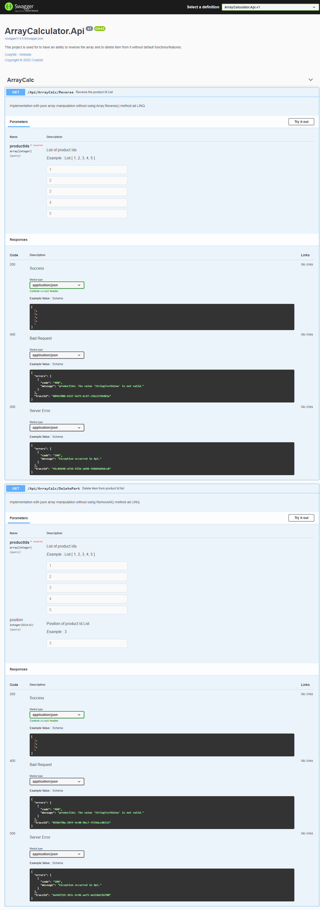
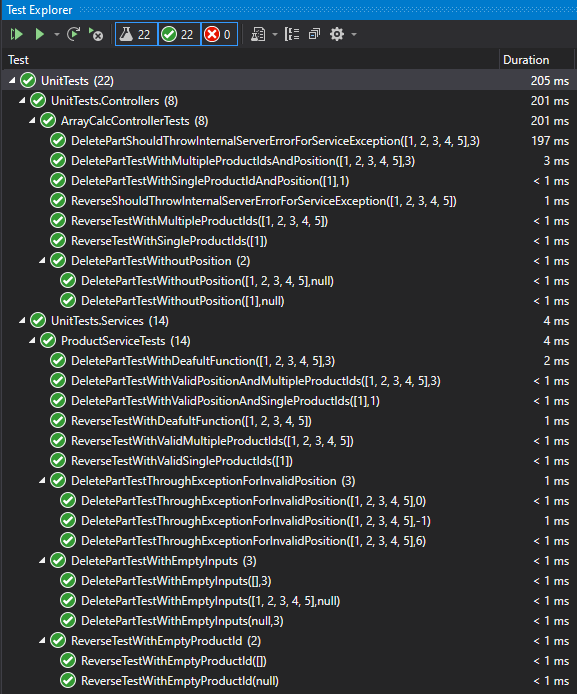

# ArrayCalculator

## Overview
This project is used for to have an ability to reverse the array and to delete item from it without default functions/features. 

Built in -
- .NET Core 5.0
- C#
- NUnit
- RESTful API
- Visual Studio 2019

### Features
API accepts the below data and return a list of porduct Ids.

##### Reverse Array:
- Browser Input 
    ```
    /api/arraycalc/reverse?productIds=1&productIds=2&productIds=3&productIds=4&productIds=5
    ```
- Browser Result
    ```json
    [
      5,
      4,
      3,
      2,
      1
    ]
    ```


##### Delete Item from Array:
- Browser Input 
    ```
    /api/arraycalc/deletepart?position=3&productIds=1&productIds=2&productIds=3&productIds=4&productIds=5
    ```
- Browser Result
    ```json
    [
      1,
      2,
      4,
      5
    ]
    ```

### Assumptions
- Implement with pure array manipulation
  * Not to use Array.reverse() and RemoveAt() method
  * Not to use LINQ.
- Applying simple structure with
  * ArrayCalcController
  * Apply Asp.NET Core IoC
  * IProductService / ProductService
- Not having Logging.
- Not having any authentication and authorization.

### Swagger Preview


### UnitTests Preview


 
Created by [CodyBit](https://github.com/CodyBit)

- [License](LICENSE.md)
 